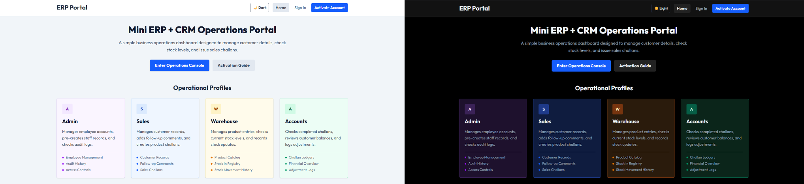
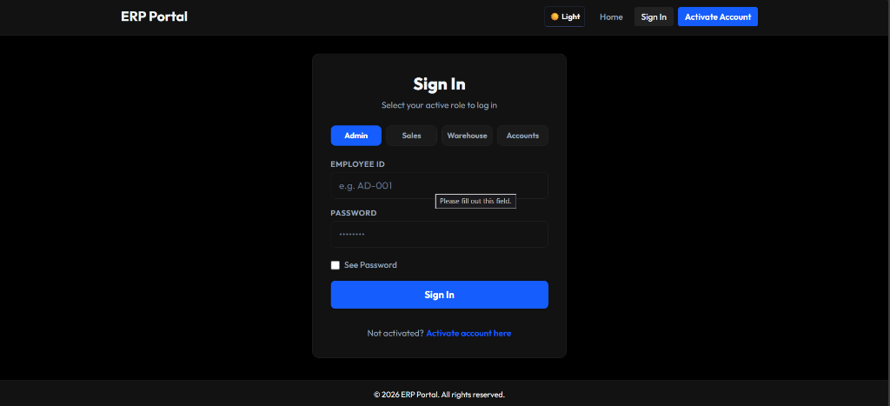
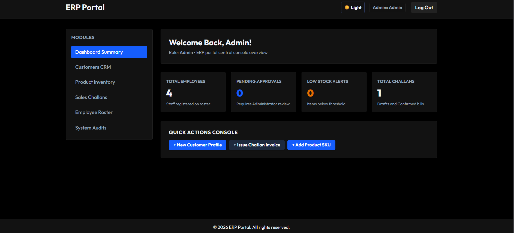
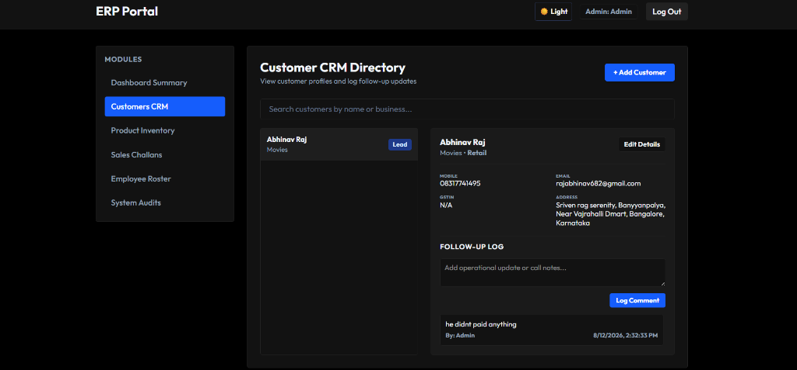
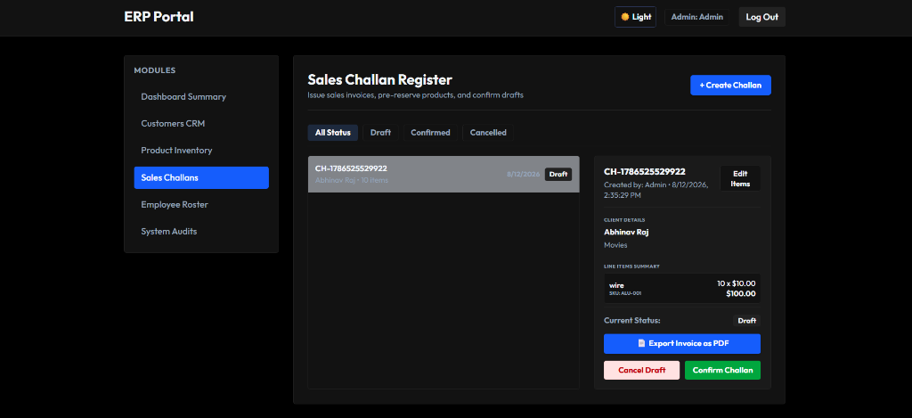
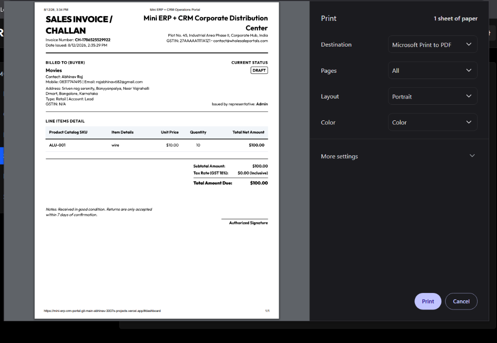
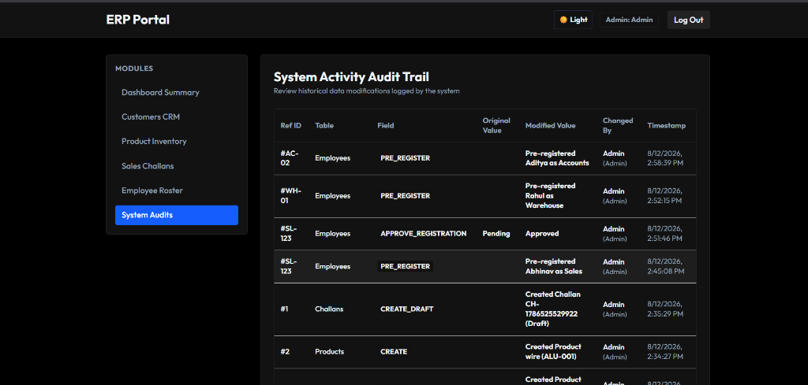

# Mini ERP + CRM Operations Portal

A premium, modern, and highly secure full-stack enterprise operations dashboard designed to manage employee rosters, customer relationships, real-time product inventory, and sales challans. 

### 🔗 Live Deployments
* **Frontend Portal (Vercel):** [https://mini-erp-crm-portal-coral.vercel.app](https://mini-erp-crm-portal-coral.vercel.app)
* **Backend API (Railway):** [https://mini-erp-crm-portal-production-375b.up.railway.app](https://mini-erp-crm-portal-production-375b.up.railway.app)

---

## 📸 Screenshots

### 1. Operations Portal Home Page (Light & Dark Theme Side-by-Side)


### 2. Sign In Console & Credentials


### 3. Dashboard Summary (Central Metrics Console)


### 4. Customers CRM Directory (with Activity Logs)


### 5. Sales Challan Registry & Invoicing Details


### 6. Invoice PDF Print Preview (Professional Layout)


### 7. System Audits (Database Change Ledger)


---

## 🌟 Key Features

### 1. Multi-Profile Access Control
Tailored operational modules and views depending on the logged-in role:
* **Admin:** Full system control, employee roster approval, pre-registering staff, audit logs.
* **Sales:** Customer database management, adding follow-up logs, issuing draft challans.
* **Warehouse:** Product inventory catalog, updating stock counts, tracking stock movement history.
* **Accounts:** Confirming or cancelling challans, reviewing customer balances, logging adjustments.

### 2. Automated Employee Pre-Registration
* Pre-register staff directly from the Admin console.
* When employees register with their **Employee ID, Name, Role, and Joining Date** matching the pre-registered details, their account is **automatically activated** without needing secondary approval.
* General registrations are submitted as **Pending** and require manual Admin approval.

### 3. Advanced Security & Compliance
* **Session Protection:** Session-based authentication via `sessionStorage` (automatically logs the user out when the browser tab or window is closed).
* **Idle Activity Timeout:** Automatically logs users out after **1 minute (60 seconds) of absolute inactivity** (monitors mouse movements, keystrokes, clicks, and scroll events).
* **Password Encryption:** Hashed using `bcrypt` and validated via JSON Web Tokens (JWT).

### 4. Sales Challans & Inventory Lifecycle
* Draft challan creation with line-item totals.
* **Confirming** a challan automatically deducts quantities from the product inventory.
* **Cancelling** or **Drafting** allows items to remain in or return to inventory safely.
* Invoices can be exported to clean PDFs instantly.

### 5. Interactive System Auditing
* Every update made to Customers, Products, or Challans creates a traceable entry in the **System Audits** log (tracks table name, changed field, old value, new value, and who modified it).

---

## 🛠️ Technology Stack

* **Frontend:** React.js, Vite, Tailwind CSS (Custom dark/light theme systems).
* **Backend:** Node.js, Express, TypeScript.
* **Database:** MySQL 8.0.
* **Orchestration:** Docker, Docker Compose.

---

## 🚀 Setup & Running Locally

### Option A: Run via Docker Compose (Recommended)
This will bootstrap the MySQL database, Backend server, and Frontend app automatically:

1. Clone the repository and navigate to the project root.
2. Build and run the containers:
   ```bash
   docker-compose up --build
   ```
3. Open `http://localhost:5173` to access the application.

---

### Option B: Run Manually

#### 1. Database Setup
1. Create a MySQL database named `erp_crm_db`.
2. Import the tables by running the SQL queries in [backend/schema.sql](backend/schema.sql).

#### 2. Running the Backend
1. Navigate to the backend directory:
   ```bash
   cd backend
   ```
2. Create a `.env` file based on `.env.example`:
   ```env
   PORT=5001
   DB_HOST=localhost
   DB_USER=root
   DB_PASSWORD=your_password
   DB_NAME=erp_crm_db
   DB_PORT=3306
   JWT_SECRET=your_jwt_secret
   ```
3. Install dependencies and start the server:
   ```bash
   npm install
   npm run build
   npm start
   ```

#### 3. Running the Frontend
1. Navigate to the frontend directory:
   ```bash
   cd frontend
   ```
2. Create a `.env` file:
   ```env
   VITE_API_URL=http://localhost:5001
   ```
3. Install dependencies and run in development mode:
   ```bash
   npm install
   npm run dev
   ```
4. Access the portal at `http://localhost:5173`.
